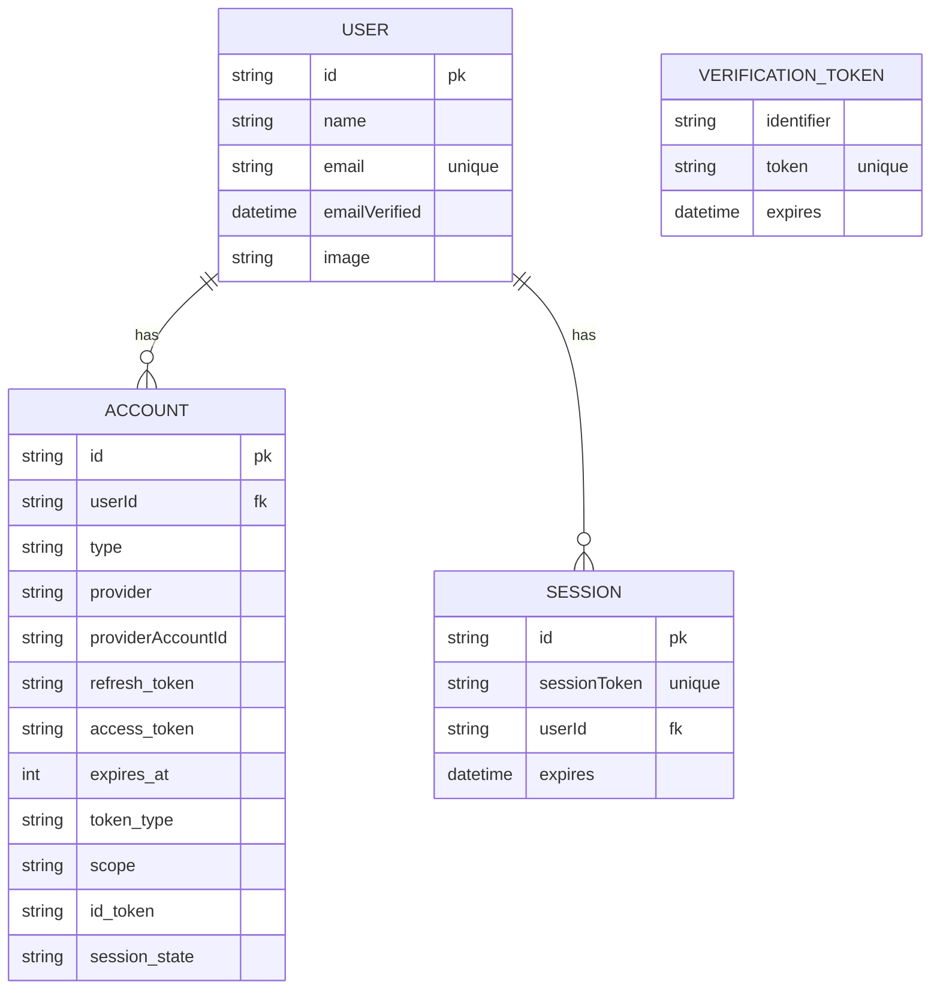

# データモデル: 認証

このドキュメントは、Better Auth と Cloudflare D1 を使用した認証機能に必要なデータエンティティを定義します。スキーマは、Better Auth の `D1Adapter` との互換性を考慮して設計されています。

## ER 図 (概念)

## エンティティ定義

### 1. User

ユーザーアカウントの基本情報を表します。

- **テーブル名**: `users`
- **フィールド**:
  - `id` (String, 主キー): ユーザーの一意な識別子。
  - `name` (String, Null 許容): ユーザーの名前。
  - `email` (String, 一意): ユーザーのメールアドレス。ログインに使用されます。
  - `emailVerified` (DateTime, Null 許容): メールアドレスが確認された日時。
  - `image` (String, Null 許容): ユーザーのアバター画像の URL。
- **リレーション**:
  - 1 対多: `Account`
  - 1 対多: `Session`

### 2. Account

ユーザーが使用する認証プロバイダー（例: "credentials", "google"など）の情報を関連付けます。

- **テーブル名**: `accounts`
- **フィールド**:
  - `id` (String, 主キー): アカウントの一意な識別子。
  - `userId` (String, 外部キー): `users`テーブルへの参照。
  - `type` (String): アカウントの種別（例: "oauth", "email"）。
  - `provider` (String): プロバイダー名（例: "google", "credentials"）。
  - `providerAccountId` (String): プロバイダー内でのユーザー ID。
  - `refresh_token` (String, Null 許容): リフレッシュトークン。
  - `access_token` (String, Null 許容): アクセストークン。
  - `expires_at` (Int, Null 許容): アクセストークンの有効期限（Unix タイムスタンプ）。
  - `token_type` (String, Null 許容): トークンの種別（例: "Bearer"）。
  - `scope` (String, Null 許容): 承認されたスコープ。
  - `id_token` (String, Null 許容): ID トークン。
  - `session_state` (String, Null 許容): セッションの状態。
- **リレーション**:
  - 多対 1: `User`

### 3. Session

ユーザーのログインセッションを管理します。

- **テーブル名**: `sessions`
- **フィールド**:
  - `id` (String, 主キー): セッションの一意な識別子。
  - `sessionToken` (String, 一意): セッショントークン。
  - `userId` (String, 外部キー): `users`テーブルへの参照。
  - `expires` (DateTime): セッションの有効期限。
- **リレーション**:
  - 多対 1: `User`

### 4. VerificationToken

メールアドレスの確認やパスワードリセットなどのために使用される一時的なトークンを保存します。

- **テーブル名**: `verification_tokens`
- **フィールド**:
  - `identifier` (String): 識別子（例: メールアドレス）。
  - `token` (String, 一意): 検証トークン。
  - `expires` (DateTime): トークンの有効期限。
- **複合主キー**: `identifier`, `token`
